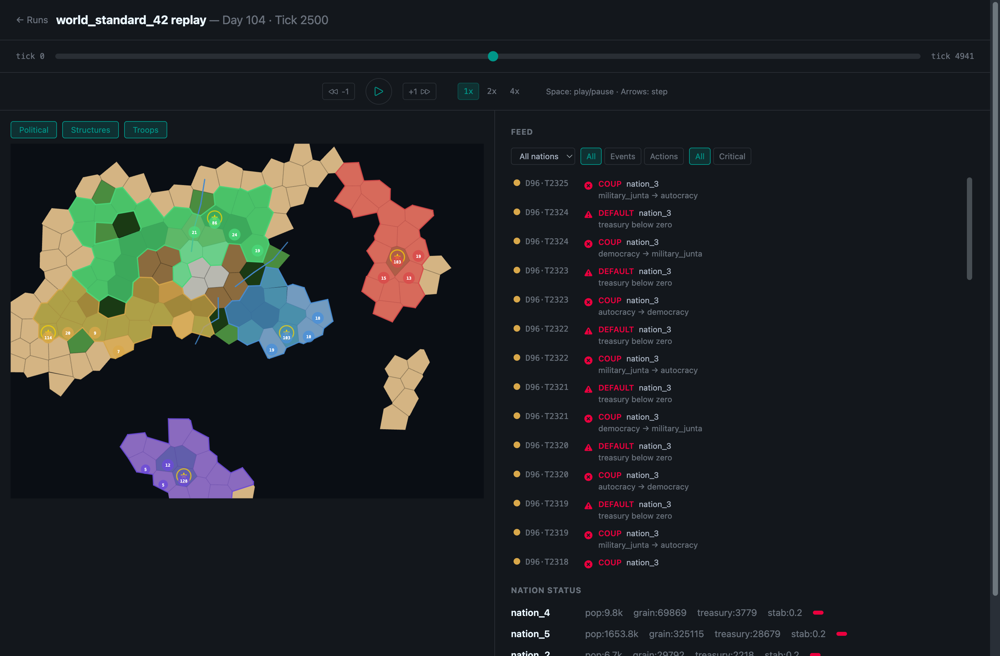
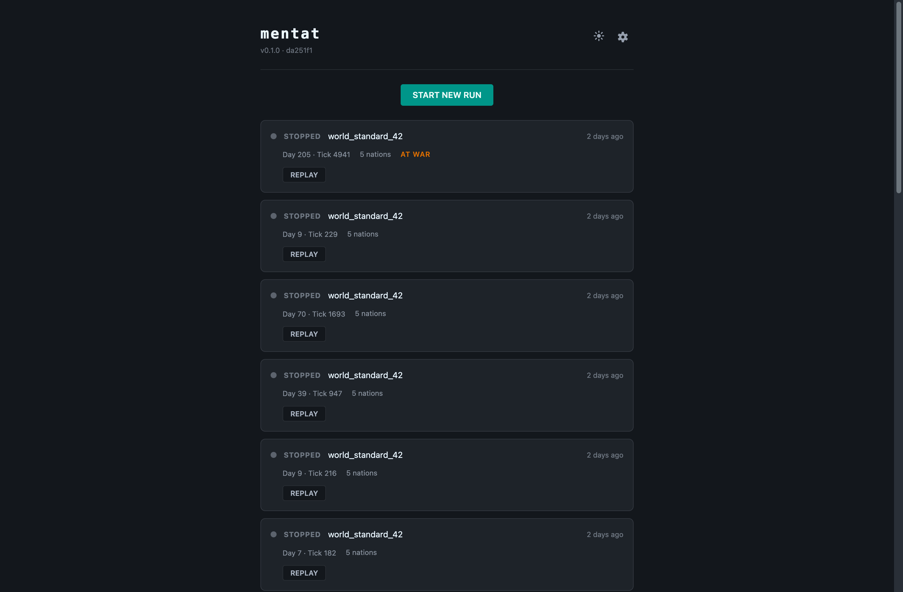

# Mentat

Mentat is an open-source, persistent geopolitical world simulation engine built on Elixir/OTP. Five nations occupy a procedurally generated map, produce resources, control territory, wage wars, and respond to political crises — continuously, whether or not anyone is watching. Nations are controlled by pluggable agents: rule-based finite state machines today, large language models tomorrow.



## Why this exists

Most AI benchmarks for strategic reasoning use discrete episodes: a game starts, agents act, the game ends, scores are tallied. This tells us nothing about how an agent behaves over weeks of simulated time — whether it drifts, forgets commitments, overreacts to compounding crises, or develops stable long-term strategies.

Mentat provides the infrastructure to study these questions. The world never resets. Every action is logged. Agents can be swapped mid-run. The engine enforces physical and political constraints — agents must operate within the rules of their government type, terrain, and resource reality.

This gap is documented empirically. Solopova et al. (2026) show that LLM alignment with human decision-making drops from ~0.5 to ~0.16–0.33 between just two simulation rounds — suggesting divergence compounds as contextual complexity accumulates. Mentat provides the infrastructure to study what happens over hundreds of rounds.

The engine implements Hybrid Constitutional Architecture (Taillandier et al., 2026): world physics enforced by the simulation layer, political rules configurable per nation, and a pluggable agent layer that accepts FSM or LLM decisions through the same interface.

## Research questions Mentat is designed to answer

- Does LLM strategic reasoning drift over extended time horizons, or do agents develop stable long-term strategies?
- Do agents honor commitments made hundreds of ticks earlier, or does commitment decay compound?
- Does ideology (realist vs liberal institutionalist framing) override structural incentives, or does physics dominate?
- When running identical scenarios with FSM and LLM agents, do outcomes converge — and if so, what does that tell us about what LLMs actually contribute?
- Does war emerge from structural conditions regardless of trigger, or do specific configurations prevent escalation over persistent time?

## What happens each tick

One tick = one simulated hour. Each tick, every nation:

1. **Collects resources** from controlled tiles (grain, oil, iron, rare earth)
2. **Updates stability** based on treasury, food supply, and active wars
3. **Checks for crises** — famines (prolonged grain shortage), coups (stability < 20%), sovereign defaults (negative treasury)
4. **Processes wars** — resolves pending declarations, checks auto-peace conditions
5. **Updates population** — births, deaths, emigration from unstable nations, troop recruitment
6. **Asks its agent** for a strategic decision (the pluggable part)
7. **Persists everything** to PostgreSQL — snapshots, events, and actions

## Architecture

The engine separates three concerns:

**Physics layer** — immutable world rules enforced by the engine. Terrain movement costs, resource production rates, fog of war, disaster propagation. No agent or political rule can override these. This is what WarAgent lacked entirely.

**Political layer** — configurable per nation in the scenario JSON. Government type, ideology parameter (the LLM system prompt injection), alliance rules, war declaration thresholds, grievance weights. Agents can push against these but the constitutional filter enforces limits. A realist nation and a liberal institutionalist nation have different political layers but the same physics.

**Agent layer** — fully pluggable. The FSM and any LLM implementation share the same interface. Agents receive only their nation's perceived world state — not ground truth — enforcing information asymmetry by default. Can be swapped mid-run without stopping the simulation.

The scenario JSON configures all three layers at world creation time.

```
                      SYSTEM ARCHITECTURE

┌───────────────────┐  ┌───────────────────┐  ┌────────────────────┐
│     Agent         │  │     Agent         │  │      Agent         │
│  FSM rules        │  │  FSM rules        │  │   FSM rules        │
│  or LLM via API   │  │  or LLM via API   │  │   or LLM via API   │
│  or human player  │  │  or human player  │  │   or human player  │
└─────────┬─────────┘  └─────────┬─────────┘  └─────────┬──────────┘
          │                      │                      │
          ▼                      ▼                      ▼
┌──────────────────┐  ┌──────────────────┐  ┌──────────────────┐
│   Nation A       │  │   Nation B       │  │   Nation C       │
│  erlang process  │  │  erlang process  │  │  erlang process  │  ...
│  state           │  │  state           │  │  state           │  N nations
│  fog of war      │  │  fog of war      │  │  fog of war      │
│  perceived world │  │  perceived world │  │  perceived world │
│  agent attached  │  │  agent attached  │  │  agent attached  │
└─────────┬────────┘  └─────────┬────────┘  └────────┬─────────┘
          │                     │                    │
          ▼                     ▼                    ▼
┌──────────────────────────────────────────────────────────────────────┐
│                       World simulation                               │
│  physics rules · resource model · tick loop · event log · persist    │
│                                                                      │
│  ┌───────────────────┐                  ┌────────────────────────┐   │
│  │ Scenario config   │                  │   Constraint filter    │   │
│  │ JSON or GUI       │                  │   validates actions    │   │
│  │ nations · map     │                  │   physics + political  │   │
│  │ flags             │                  │   rules                │   │
│  └───────────────────┘                  └────────────────────────┘   │
└──────────────────────────────────────────────────────────────────────┘


                  NATION MODEL — THREE LAYERS

┌───────────────────────────────────────────────────────────────────┐
│                         Nation process                            │
│                                                                   │
│   ┌───────────────────────┐       ┌──────────────────────────┐    │
│   │     FSM agent         │       │       LLM agent          │    │
│   │  rule-based decisions │       │  pluggable via API       │    │
│   │  deterministic · fast │  or   │  ideology param injected │    │
│   │  no LLM cost          │       │  decisions logged+scored │    │
│   │  baseline comparison  │       │  swappable mid-run       │    │
│   └──────────┬────────────┘       └─────────────┬────────────┘    │
│              └──────────────┬───────────────────┘                 │
│                             ▼                                     │
│   ┌──────────────────────────────────────────────────────────┐    │
│   │         Political layer — configurable per scenario      │    │
│   │                                                          │    │
│   │  government type · ideology parameter · alliance rules   │    │
│   │  trade law · war declaration thresholds                  │    │
│   │  betrayal memory · grievance weights                     │    │
│   │  can be bent by agents within limits                     │    │
│   │  drives constitutional filter                            │    │
│   │  defined in scenario JSON · different per nation         │    │
│   └────────────────────────────┬─────────────────────────────┘    │
│                                ▼                                  │
│   ┌──────────────────────────────────────────────────────────┐    │
│   │           Physics layer — immutable                      │    │
│   │                                                          │    │
│   │  terrain · resource production · troop movement speed    │    │
│   │  structure constraints · fog of war rules                │    │
│   │  disaster propagation · anonymization flag               │    │
│   │  cannot be changed by any agent or political rule        │    │
│   └──────────────────────────────────────────────────────────┘    │
└───────────────────────────────────────────────────────────────────┘
```

## The agent

The current FSM agent evaluates rules in priority order:

- **Survival**: if grain is low, pathfind to the nearest unclaimed grain tile
- **Expansion**: if stable, claim the nearest unclaimed territory
- **Aggression**: score enemy border tiles by resource value and troop advantage, declare war or attack
- **Consolidation**: pull excess troops from the periphery toward the capital

All movement uses BFS pathfinding that respects terrain costs. The agent can be replaced with any module that returns a `%{type: :move_troops | :declare_war, ...}` struct.

## Government types

Each nation starts with a government that determines how fast it can act:

| Government | War declaration | Troop movement | Example |
|---|---|---|---|
| Democracy | 168 ticks (parliament vote) | 6 ticks | Slow but stable |
| Autocracy | 24 ticks (supreme decree) | 2 ticks | Fast, volatile |
| Constitutional Monarchy | 72 ticks (royal assent) | 4 ticks | Balanced |
| Oligarchy | 48 ticks (council majority) | 4 ticks | Moderate |
| Military Junta | 12 ticks (general order) | 1 tick | Fastest |

Coups randomly change the government type when stability drops below 20%.

## Map generation

Mentat generates Voronoi-based maps with procedural terrain, resources, and river systems. Four presets are available:

- **Standard** — balanced single continent
- **Archipelago** — island clusters separated by ocean
- **Pangea** — one large landmass with more plains
- **Divided** — two continents connected by a strait

Terrain types: ocean, coast, plains, forest, hills, and mountains — each with different movement costs and defensive bonuses.

## Web interface

The Phoenix LiveView interface provides:

- **Runs list** (`/runs`) — start simulations, view all past and active runs with nation count, war status, and tick progress
- **Live view** (`/runs/:id/live`) — watch a running simulation in real time with map, nation status cards, and activity feed
- **Replay** (`/runs/:id/replay`) — scrub to any tick, inspect the full world state, play back at 1x/2x/4x speed
- **Map preview** (`/map/:scenario`) — explore scenario maps with political, structure, and troop overlays
- **Settings** (`/settings`) — generate new maps, manage scenarios
- **Light/dark theme** — toggle with localStorage persistence

The activity feed merges FSM actions and passive events with filtering by nation, type, and severity.



## Running locally

```bash
# Prerequisites: Elixir 1.15+, PostgreSQL 15+, Node.js 20+

git clone https://github.com/jeanlucaslima/mentat.git
cd mentat
mix setup

# Start the dev server
mix phx.server

# Or with an interactive shell
iex -S mix phx.server

# Run tests
mix test

# Run pre-commit checks (compile with warnings-as-errors, format, test)
mix precommit
```

## Project structure

```
lib/mentat/              # Simulation engine
  nation.ex              # Tick pipeline (resources, stability, wars, population)
  nation_agent/fsm.ex    # Rule-based agent
  simulation.ex          # Start/stop orchestration
  clock.ex               # Tick scheduler
  queries.ex             # Database queries
  map_gen/               # Procedural map generation
lib/mentat_web/          # Phoenix web layer
  live/                  # LiveView modules (runs, live, replay, settings, map)
  components/            # Shared UI components (feed, map, core)
priv/scenarios/          # Scenario definitions (JSON)
config/                  # Environment configs
```

## License

Apache License 2.0. See [LICENSE](LICENSE) for details.

## Research collaborations

Mentat is designed as open research infrastructure. If you are studying long-horizon LLM behavior, multi-agent coordination, geopolitical simulation, or AI evaluation methodology, there are several ways to engage:

- **Run your own agent** — implement the agent behaviour interface and plug in any LLM or rule system
- **Design a scenario** — define nations, map presets, ideology parameters, and resource distributions in JSON
- **Reproduce experiments** — scenario files are version-controlled; every run is fully replayable
- **Collaborate on a paper** — reach out if you are working on related questions

Open an issue or reach out directly.
